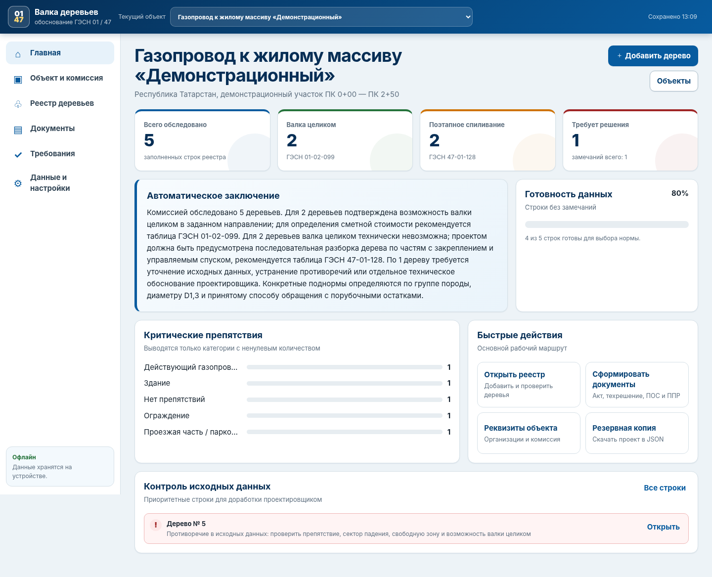

# «Валка деревьев — ГЭСН 01/47»

Готовое мобильное PWA-приложение для обследования деревьев, фиксации условий производства работ, автоматического выбора технологии и подготовки комплекта обосновывающих документов.

Приложение перенесено из Excel-формы и работает на телефоне, планшете и компьютере. После установки может использоваться без подключения к интернету.



## Что реализовано

- ведение нескольких объектов в одном приложении;
- карточка объекта и состав комиссии;
- реестр деревьев с поиском и фильтрами;
- выпадающие значения по препятствиям и условиям валки;
- автоматический выбор между:
  - валкой дерева целиком — **ГЭСН 01-02-099**;
  - поэтапным спиливанием с управляемым спуском частей — **ГЭСН 47-01-128**;
- автоматический подбор конкретной поднормы по группе породы, диаметру и способу обращения с порубочными остатками;
- контроль неполных и противоречивых исходных данных;
- фотофиксация с камеры телефона, координаты GPS и ссылки на схемы;
- автоматические итоги по объекту;
- автоматическое заключение без фраз о категориях, количество которых равно нулю;
- формирование четырех документов из одного реестра:
  1. акт комиссионного обследования;
  2. техническое решение проектной организации;
  3. фрагмент ПОС;
  4. ППР / технологическая карта;
- печать документов и сохранение в PDF через системный диалог печати;
- выгрузка отдельного документа в HTML;
- экспорт реестра в CSV для Excel;
- резервные копии одного объекта или всей базы в JSON;
- импорт ранее сохраненной резервной копии;
- локальное офлайн-хранение данных и фотографий в IndexedDB;
- адаптивная мобильная и настольная версия.

## Быстрый запуск на компьютере

1. Распакуйте архив, не меняя структуру папок.
2. Запустите `start_windows.bat`.
3. Приложение откроется по адресу `http://localhost:8080/`.

Для такого запуска нужен Python 3. Альтернативные скрипты: `start.ps1` для PowerShell и `start.sh` для Linux/macOS.

## Установка на телефон как PWA

Для полноценной установки на смартфон папку приложения необходимо разместить на HTTPS-хостинге. Загружать следует **содержимое папки**, чтобы `index.html`, `sw.js`, `manifest.webmanifest`, папки `js` и `icons` находились на одном уровне.

После публикации:

- Android/Windows: открыть адрес приложения в браузере и выбрать «Установить приложение»;
- iPhone/iPad: открыть адрес в Safari → «Поделиться» → «На экран Домой».

После первого успешного открытия основные файлы приложения кэшируются, поэтому реестр и документы доступны офлайн.

## Важное ограничение

Автоматический результат является средством проверки и подготовки обоснования. Он не заменяет подписанное техническое решение проектной организации, проектную документацию, ПОС, ППР и ответственность участников комиссии за достоверность исходных данных и безопасность технологии.

Подробный рабочий порядок приведен в файле [ИНСТРУКЦИЯ_ПОЛЬЗОВАТЕЛЯ.md](ИНСТРУКЦИЯ_ПОЛЬЗОВАТЕЛЯ.md). Результаты испытаний приведены в [ОТЧЕТ_О_ТЕСТИРОВАНИИ.md](ОТЧЕТ_О_ТЕСТИРОВАНИИ.md).

## Структура проекта

```text
index.html                  главный файл приложения
styles.css                 оформление и мобильная адаптация
manifest.webmanifest       параметры установки PWA
sw.js                      офлайн-кэширование
js/domain.js               расчетный алгоритм и справочники
js/storage.js              локальное хранение данных
js/templates.js            формирование акта, техрешения, ПОС и ППР
js/app.js                  интерфейс и действия пользователя
icons/                     иконки приложения
examples/                  демонстрационная резервная копия
screenshots/               контрольные изображения интерфейса
tests/                     автоматические тесты
```

## Команды разработчика

```bash
npm run check       # синтаксическая проверка JavaScript
npm test            # модульные тесты расчетного алгоритма
npm run test:pwa    # проверка manifest, service worker и иконок
npm run test:ui     # интерфейсные тесты desktop/mobile
npm run test:all    # полный автоматический прогон
npm run serve       # локальный сервер на порту 8080
```

Версия приложения: **1.0.0**.
